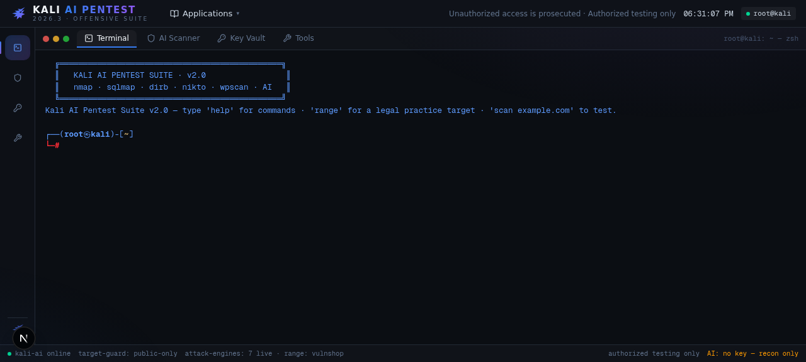
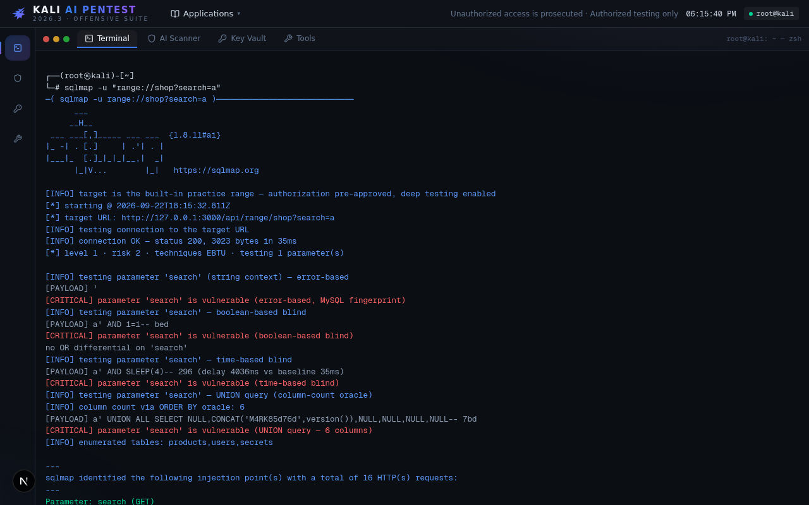
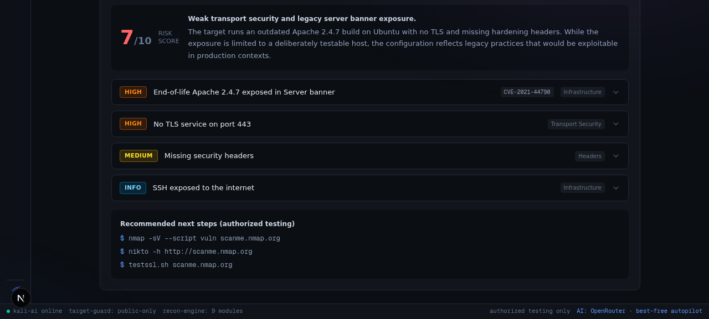

<div align="center">

# 🐉 Kali AI Pentest Suite

**A Kali Linux–styled web suite that scans websites for vulnerabilities with AI — powered by your OpenAI/OpenRouter key, with a built-in engine that works with zero setup.**

*7 live attack engines · AI copilot · AI attack planner · built-in practice range*



</div>

## ✨ Features

| | |
|---|---|
| 🖥️ **Kali desktop UI** | boot sequence, panel, dock, and a real tabbed terminal (tab-completion, history, Ctrl+C/L) |
| 🤖 **AI vulnerability reports** | recon evidence → severity-rated findings, risk score, remediations, next steps (MD/JSON export) |
| 🔑 **BYO key + autopilot** | OpenAI keys (`sk-…`) or OpenRouter keys (`sk-or-…`); OpenRouter always auto-runs the **best $0 free model** with live failover |
| ⚙️ **Built-in engine** | no key? every AI feature still works out of the box — and takes over silently if your provider fails |
| ⚔️ **7 live attack engines** | `nmap` · `sqlmap` · `dirb`/`gobuster` · `nikto` · `wpscan` · `searchsploit` — pure TypeScript, no binaries required |
| 🧠 **AI attack planner** | `ai plan <target>` recons the host, composes a toolchain, executes step-by-step |
| 🧪 **VULNSHOP range** | deliberately vulnerable local shop (SQLi, auth bypass, exposed `.env`/`.git`) to test everything legally |
| 🛡️ **Guardrails** | authorization gate for active scans, SSRF/private-IP blocklist, read-only payloads by design |



## 🚀 Quick start

```bash
# node 20+ recommended (bun also works)
npm install
npm run dev
# → http://localhost:3000
```

Or with Docker:

```bash
docker build -t kali-ai-pentest-suite .
docker run -p 3000:3000 kali-ai-pentest-suite
```

Then open the app, run `range` in the terminal and try:

```
nmap range --range
sqlmap -u "range://shop?search=a"
scan example.com
```

## 🔑 AI providers

Open the **KEY VAULT** tab (or `ai key <provider> <key>` in the terminal):

| Provider | Key format | Behavior |
|---|---|---|
| *(none)* | — | built-in KAI-SEC engine answers — everything works |
| **OpenAI** | `sk-…` | routed to api.openai.com (default model `gpt-4o-mini`, configurable) |
| **OpenRouter** | `sk-or-…` | fetches the live catalogue and **always picks the best $0 free model**; on 429/errors it fails over to the next free model automatically |

If a provider is unreachable, rate-limited, or the key is rejected, the suite falls back to the built-in engine and says so — **requests never hang forever** (60s per provider call, 150s overall budget, live `KAI is thinking… Ns` indicator, Ctrl+C to abort).

> **Self-hosting the built-in engine:** it uses [`z-ai-web-dev-sdk`](https://www.npmjs.com/package/z-ai-web-dev-sdk), which reads a `.z-ai-config` JSON file (`{"baseUrl": "https://<openai-compatible-endpoint>/v1", "apiKey": "…"}`) from the project dir, `~`, or `/etc`. See `.z-ai-config.example`. Without it, just use your own OpenAI/OpenRouter key.

Keys are stored **browser-local only** (localStorage) and sent per-request to the backend — never persisted server-side, never committed.

## 🕹️ Usage

**Terminal** (main tab):

```
scan <target> [--deep]      full recon + AI vulnerability report
ai ask <question>           security copilot Q&A
ai plan <target>            AI attack toolchain → run <n> to execute
nmap / sqlmap / dirb / gobuster / nikto / wpscan / searchsploit
range                       show the built-in practice target + recipes
help
```

**AI Scanner tab:** enter a target, tick the authorization box, watch the live recon pipeline, and get a formatted vulnerability report (risk score, findings, next steps) with Markdown/JSON export.



## 🏗️ Architecture

- **Next.js 16 (App Router) + TypeScript + Tailwind 4** · NDJSON streaming APIs
- **Attack engines are pure TypeScript** (`src/lib/pentest/`) — no native binaries, so it runs anywhere Node runs: TCP connect scans with service/OS detection, SQLi (error/boolean/time/UNION), content discovery (500+ wordlist), web misconfig scanner, WordPress enumerator, offline exploit DB
- **AI layer** (`src/lib/ai.ts`): provider chain → OpenAI → OpenRouter best-free → built-in engine, with bounded timeouts and JSON repair

```
src/
├── app/api/          exec · tools · recon · pentest · range · ai/{chat,plan,analyze} · openrouter/models
├── components/kali/  boot · desktop shell · terminal · scanner · key-vault · tools-grid
└── lib/              target-guard (SSRF blocklist) · recon pipeline · pentest engines · ai · openrouter
```

## ⚠️ Legal & responsible use

This tool is for **authorized security testing only** — your own systems or targets you have written permission to assess. Active tools require a `--auth` acknowledgment for public targets; private/loopback ranges are blocked. Do not scan systems you do not own. The built-in VULNSHOP range exists so you can learn and demo safely.

## 📄 License

MIT — see [LICENSE](LICENSE).
